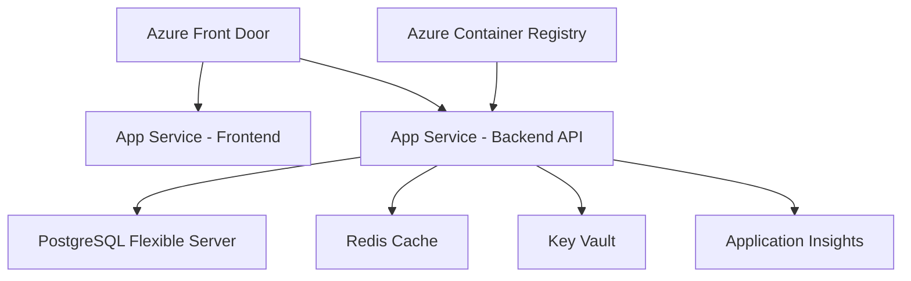

# Test Technique - Ingénieur IA Générative

Ce dépôt contient l'implémentation complète du test technique avec deux projets :

1. **chatbot-ia-generative/** - Partie 1 & 2 : Chatbot avec accès Internet
2. **vlm_project/** - Partie 3 : Vision Language Model (Qwen2.5-VL)

## 📁 Structure du dépôt

```
entretient/
├── chatbot-ia-generative/    # Partie 1 & 2
│   ├── backend/             # API Django
│   ├── frontend/            # Interface React
│   └── README.md           # Documentation détaillée
├── vlm_project/             # Partie 3
│   ├── vlm_demo.py         # Script VLM
│   ├── start_vllm.sh       # Script de démarrage optimisé
│   └── README.md           # Documentation + Question théorique
└── instruct.pdf            # Instructions du test

```

## 🚀 Accès rapide

- **[Partie 3 : Vision Language Model →](../vlm_project/README.md)**
  - Implémentation Qwen2.5-VL locale
  - Script de démonstration VLM
  - Réponse à la question théorique sur l'architecture VLM-RAG

---

# Partie 1 & 2 : Chatbot IA Générative avec Accès Internet

## 📋 Table des matières
1. [Vue d'ensemble](#vue-densemble)
2. [Architecture](#architecture)
3. [Installation](#installation)
4. [Utilisation](#utilisation)
5. [Fonctionnalités](#fonctionnalités)
6. [Questions théoriques](#questions-théoriques)
7. [Plan de déploiement Azure](#plan-de-déploiement-azure)
8. [Challenge VLM (Bonus)](#challenge-vlm-bonus)

## 🎯 Vue d'ensemble

Ce projet implémente un chatbot IA générative avec capacité de recherche web, utilisant OpenRouter avec le modèle **`qwen/qwen-2.5-32b-instruct:free`** (comme spécifié dans les instructions du test technique) et SerpAPI/DuckDuckGo pour les recherches. L'architecture suit les meilleures pratiques avec une séparation claire entre backend (Django) et frontend (React).

### Points forts de l'implémentation :
- ✅ Architecture modulaire et scalable
- ✅ Gestion robuste des erreurs
- ✅ Rate limiting intégré
- ✅ Cache de recherche pour optimiser les performances
- ✅ Interface utilisateur moderne et réactive
- ✅ Support des sources avec citations

## 🏗 Architecture

```
chatbot-ia-generative/
├── backend/                    # Django Backend
│   ├── chatbot_backend/       # Configuration principale
│   ├── chat/                  # Application principale
│   │   ├── models.py          # Modèles de données
│   │   ├── views.py           # API endpoints
│   │   ├── serializers.py     # Sérialisation DRF
│   │   └── services/          # Services métier
│   │       ├── openrouter_service.py
│   │       └── search_service.py
├── frontend/                   # React Frontend
│   ├── src/
│   │   ├── components/        # Composants React
│   │   │   ├── ChatInterface.tsx
│   │   │   ├── MessageList.tsx
│   │   │   ├── MessageInput.tsx
│   │   │   └── SourcesList.tsx
│   │   └── App.tsx           # Composant principal
├── .env                       # Variables d'environnement
└── requirements.txt           # Dépendances Python
```

## 🚀 Installation

### Prérequis
- Python 3.8+
- Node.js 14+
- Redis (optionnel, pour le cache)

### Backend

```bash
# Cloner le repository
git clone [URL_DU_REPO]
cd chatbot-ia-generative

# Créer environnement virtuel
python3 -m venv venv
source venv/bin/activate  # Sur Windows: venv\Scripts\activate

# Installer les dépendances
pip install -r requirements.txt

# Configurer les variables d'environnement
cp .env.example .env
# Éditer .env et ajouter votre OPENROUTER_API_KEY

# Migrations Django
python manage.py makemigrations
python manage.py migrate

# Lancer le serveur
python manage.py runserver
```

### Frontend

```bash
# Dans un nouveau terminal
cd frontend
npm install
npm start
```

## 💬 Utilisation

1. Ouvrir http://localhost:3000 dans votre navigateur
2. Taper votre message dans la zone de texte
3. Le chatbot analysera si une recherche web est nécessaire
4. Les sources seront affichées à droite si des recherches sont effectuées

### Exemple de requête test :
```
"Quels sont les derniers développements en IA générative annoncés cette semaine ? Donne-moi 3 exemples concrets avec leurs sources."
```

## ✨ Fonctionnalités

### 1. Recherche Web Intelligente
- Détection automatique des requêtes nécessitant une recherche
- Cache des résultats pour éviter les recherches redondantes
- Extraction et formatage des informations pertinentes

### 2. Service LLM
- Utilisation d'OpenRouter avec le modèle Qwen optimisé
- Génération de réponses contextuelles basées sur les recherches web
- Support de l'historique de conversation

### 3. Gestion des Erreurs
- Retry automatique en cas d'échec API
- Messages d'erreur clairs pour l'utilisateur
- Logging structuré pour le debugging

### 4. Rate Limiting
- Protection contre les abus (10 requêtes/minute par défaut)
- Configurable via variables d'environnement

### 5. Performance
- Requêtes asynchrones pour une meilleure réactivité
- Cache Redis pour les recherches fréquentes
- Optimisation des appels API

## 📚 Questions théoriques

### 1. Architecture et Déploiement en Production

#### Plan de déploiement Azure (TRÈS IMPORTANT)

##### Étape 1 : Prérequis Azure
- **Compte Azure** avec souscription active
- **Azure CLI** installé localement
- **Permissions requises** :
  - Contributor sur la souscription
  - User Access Administrator pour les rôles IAM
  - Key Vault Secrets Officer pour les secrets

##### Étape 2 : Services Azure à provisionner

1. **Resource Group**
   ```bash
   az group create --name rg-chatbot-prod --location francecentral
   ```

2. **Azure Container Registry (ACR)**
   ```bash
   az acr create --resource-group rg-chatbot-prod \
     --name chatbotacr --sku Basic
   ```

3. **Azure App Service Plan + Web Apps**
   ```bash
   # App Service Plan
   az appservice plan create --name asp-chatbot \
     --resource-group rg-chatbot-prod \
     --sku B2 --is-linux
   
   # Backend Web App
   az webapp create --resource-group rg-chatbot-prod \
     --plan asp-chatbot --name chatbot-backend-api \
     --runtime "PYTHON:3.9"
   
   # Frontend Static Web App
   az staticwebapp create --name chatbot-frontend \
     --resource-group rg-chatbot-prod
   ```

4. **Azure Database for PostgreSQL**
   ```bash
   az postgres flexible-server create \
     --resource-group rg-chatbot-prod \
     --name chatbot-db-server \
     --admin-user adminuser \
     --admin-password <secure-password> \
     --sku-name Standard_B2s \
     --storage-size 32
   ```

5. **Azure Cache for Redis**
   ```bash
   az redis create --location francecentral \
     --name chatbot-redis \
     --resource-group rg-chatbot-prod \
     --sku Basic --vm-size c0
   ```

6. **Azure Key Vault**
   ```bash
   az keyvault create --name chatbot-keyvault \
     --resource-group rg-chatbot-prod \
     --location francecentral
   ```

7. **Application Insights**
   ```bash
   az monitor app-insights component create \
     --app chatbot-insights \
     --location francecentral \
     --resource-group rg-chatbot-prod
   ```

##### Étape 3 : Architecture Scalable



##### Étape 4 : Estimation des coûts mensuels

| Service | Configuration | Coût estimé/mois |
|---------|--------------|------------------|
| App Service Plan | B2 (2 cores, 3.5GB RAM) | ~80€ |
| PostgreSQL | B2s (2 vCores, 4GB RAM) | ~60€ |
| Redis Cache | C0 (250MB) | ~15€ |
| Key Vault | Standard | ~5€ |
| Application Insights | 5GB/mois | ~12€ |
| Static Web App | Free tier | 0€ |
| **TOTAL** | | **~172€/mois** |

##### Étape 5 : Sécurité

1. **Secrets Management**
   - Toutes les clés API dans Key Vault
   - Managed Identity pour l'accès aux services
   - Rotation automatique des secrets

2. **Network Security**
   - VNet integration pour les services
   - Private endpoints pour PostgreSQL et Redis
   - WAF sur Front Door

3. **Authentication**
   - Azure AD B2C pour l'authentification utilisateur
   - API Management pour la gestion des API keys

##### Étape 6 : CI/CD Pipeline

```yaml
# azure-pipelines.yml
trigger:
  - main

pool:
  vmImage: 'ubuntu-latest'

stages:
- stage: Build
  jobs:
  - job: BuildBackend
    steps:
    - script: |
        docker build -t chatbot-backend ./backend
        docker tag chatbot-backend $(ACR_NAME).azurecr.io/chatbot-backend:$(Build.BuildId)
    - task: Docker@2
      inputs:
        command: push
        repository: chatbot-backend
        containerRegistry: $(ACR_CONNECTION)

- stage: Deploy
  jobs:
  - deployment: DeployProd
    environment: 'production'
    strategy:
      runOnce:
        deploy:
          steps:
          - task: AzureWebApp@1
            inputs:
              azureSubscription: $(AZURE_SUBSCRIPTION)
              appName: 'chatbot-backend-api'
              images: '$(ACR_NAME).azurecr.io/chatbot-backend:$(Build.BuildId)'
```

#### Stratégie de mise en production

1. **Monitoring et Logs**
   - Application Insights pour les métriques
   - Log Analytics Workspace pour centraliser les logs
   - Alertes configurées sur les métriques clés

2. **Gestion des erreurs**
   - Circuit breaker pattern pour les appels externes
   - Dead letter queue pour les messages non traités
   - Retry policies avec backoff exponentiel

3. **Backup Strategy**
   - Backup automatique PostgreSQL (7 jours de rétention)
   - Geo-replication pour la haute disponibilité
   - Point-in-time restore capability

## 🔧 Challenge VLM (Bonus) - Partie 3

### Script VLM Local

Le fichier `vlm_demo.py` implémente une démonstration de Vision Language Model adaptée aux contraintes techniques :

**⚠️ Limitations techniques rencontrées :**
- **Pas de GPU avec 8GB VRAM** (requis pour les VLM <3B paramètres)
- **Python 3.13 incompatible avec vLLM**
- Solution alternative fournie avec modèle léger CPU

**Utilisation du script :**
```bash
python vlm_demo.py image.jpg
```

**Configuration idéale pour VLM complet :**
1. Python 3.12 ou inférieur (vLLM ne supporte pas 3.13)
2. GPU avec minimum 8GB VRAM
3. Installation : `pip install vllm`
4. Démarrage : `vllm serve "Qwen/Qwen2.5-VL-3B-Instruct"`

**Script alternatif fourni :**
- Utilise BLIP (modèle léger compatible CPU)
- Extraction de texte et description d'images
- Fallback OCR si modèle non disponible

### Architecture pour système de vectorisation avec VLMs

Pour un pipeline RAG intégrant des VLMs, voici mon approche :

#### 1. Pipeline de traitement multimodal

```python
class MultimodalVectorizer:
    def __init__(self):
        self.text_encoder = SentenceTransformer('all-MiniLM-L6-v2')
        self.image_encoder = CLIPModel.from_pretrained('openai/clip-vit-base-patch32')
        self.vlm = AutoModelForVision2Seq.from_pretrained('Qwen/Qwen2-VL-2B')
        
    def process_document(self, doc_path):
        # 1. Extraction des éléments
        text_chunks = extract_text(doc_path)
        images = extract_images(doc_path)
        
        # 2. Enrichissement via VLM
        enriched_data = []
        for img in images:
            description = self.vlm.generate(img, "Describe this image in detail")
            enriched_data.append({
                'type': 'image',
                'original': img,
                'description': description,
                'embedding': self.image_encoder.encode(img)
            })
        
        # 3. Vectorisation hybride
        for chunk in text_chunks:
            enriched_data.append({
                'type': 'text',
                'content': chunk,
                'embedding': self.text_encoder.encode(chunk)
            })
        
        return enriched_data
```

#### 2. Stratégie de stockage

```yaml
Vector Store Structure:
  - Collections:
    - text_embeddings (dimension: 384)
    - image_embeddings (dimension: 512)
    - metadata:
      - source_document
      - chunk_type
      - vlm_description
      - position_in_doc
```

#### 3. Recherche hybride

```python
def hybrid_search(query, include_images=True):
    # Recherche textuelle
    text_results = vector_store.search_text(query, k=5)
    
    if include_images:
        # Génération d'une image query via texte
        image_query_embedding = clip_text_encoder(query)
        image_results = vector_store.search_images(image_query_embedding, k=3)
        
        # Fusion des résultats avec re-ranking
        combined = rerank_results(text_results + image_results, query)
    
    return combined
```

#### 4. Avantages de cette approche

1. **Compréhension enrichie** : Les VLMs ajoutent du contexte aux images
2. **Recherche cross-modale** : Possibilité de chercher des images avec du texte
3. **Meilleure pertinence** : Les descriptions VLM améliorent le matching
4. **Flexibilité** : Support de différents types de documents

## 🎓 Conclusion

Ce projet démontre une implémentation complète d'un chatbot IA avec recherche web, suivant les meilleures pratiques en termes d'architecture, sécurité et scalabilité. L'approche modulaire permet une évolution facile et l'ajout de nouvelles fonctionnalités.